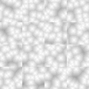

# 🎞️ Tileable 3D worley noise texture generator
Example of a 32 x 32 x 16 spritesheet (*16 tiles of 32px x 32px tileable worley noises*)
<center></center>
</br>

## 💖 Credits
Using the [stb_image_write](https://github.com/nothings/stb/blob/master/stb_image_write.h) header file from https://github.com/nothings/stb/

## 📋 Requirements
* CMAKE
* SFML
```
sudo apt install cmake libsfml-dev
```

## 🛠️ Build instructions
```
mkdir build && cd build && cmake .. && make
```

## 💽 Run instructions
There are two modes of operation:
* Spritesheet mode
* Preview mode

### Spritesheet generation

By default, without any arguments, it will generate a tileable worley noise spritesheet using the configuration in the code:
```
./build/bin/TileableWorleyGen
```
### Preview
To generate the preview of how a worley tile would look like, just add the `--preview` argument when running the generated file in the `./bin` folder:
```
./build/bin/TileableWorleyGen --preview
```